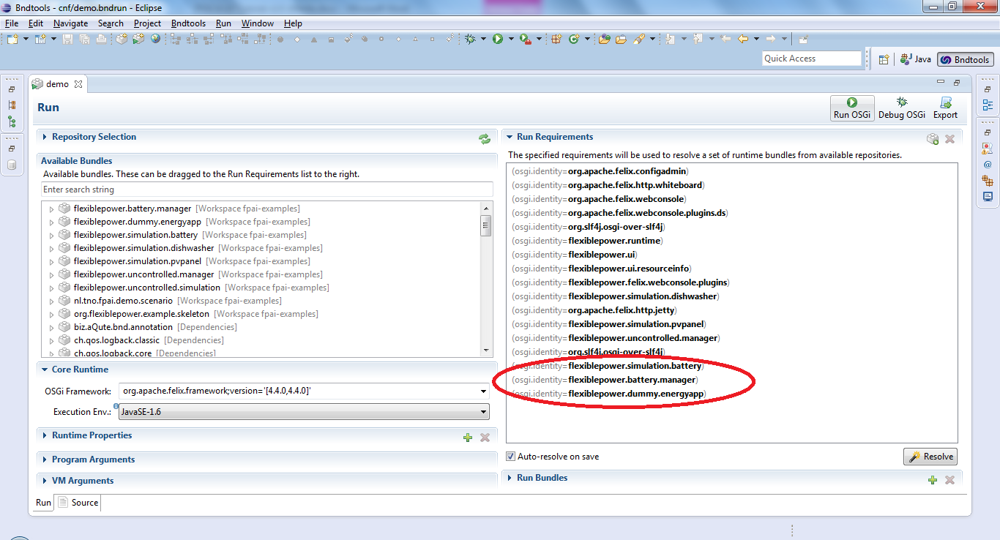
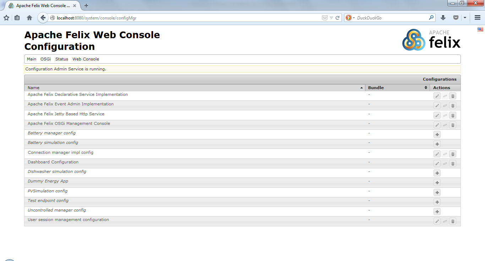
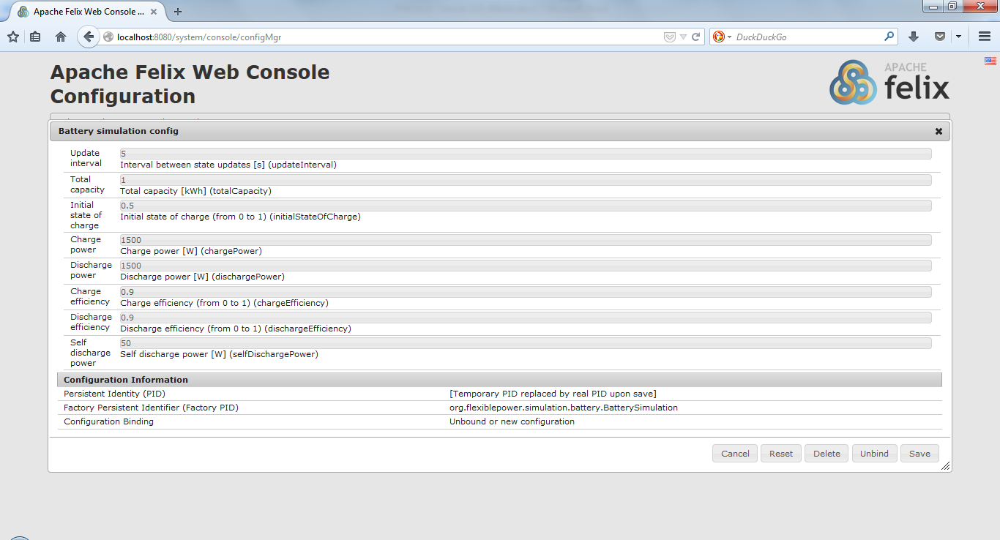
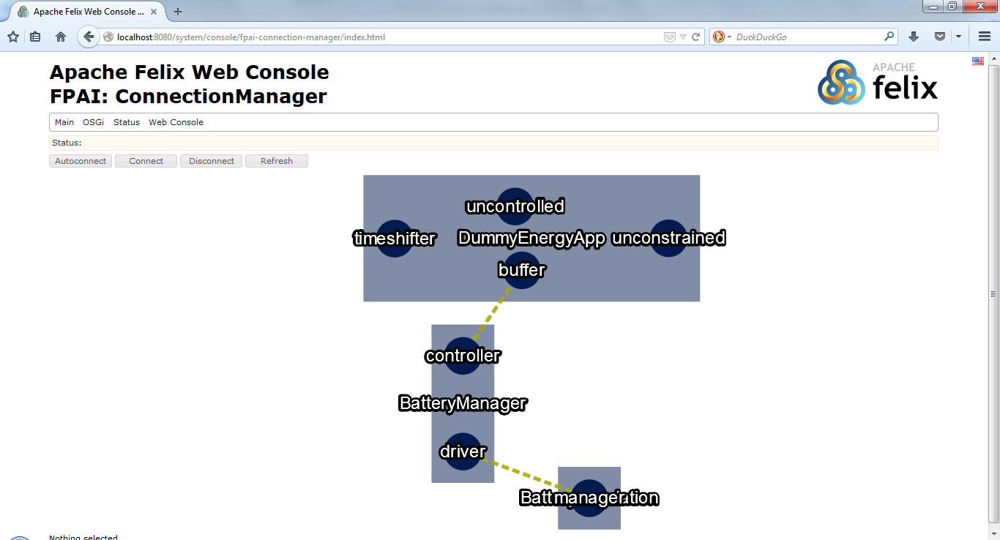
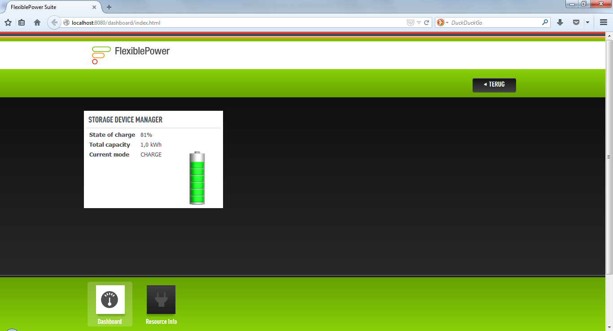

# 7. Running the FPAI examples
This section shows how to run the battery simulation, the battery manager and the dummy energy app. The following steps need to be performed.

Open the <i>demo.bndrun</i> file in the <i>cnf</i> project.

Make sure that `org. flexiblepower.simulation.battery`, `flexiblepower.battery.manager` and `flexiblepower.dummy.energyapp` are part of the “Run Requirements”. Click the “Resolve” button to check whether additional resources are needed and then press “Finish”. Save the `demo.bndrun` file and click on the “Run OSGi” button. This will start OSGI.

Point your web browser at <i>http://localhost:8080</i> to see the Dashboard of FPAI.

Open another tab and go to <i>http://localhost:8080/system/console/configMgr</i>. Should you need to authenticate yourself use “admin”, “admin”.

Press the “+” button next to “Battery simulation config”.

This opens the configuration for the battery simulation, which contains several configuration items to control the simulation of the battery. Simply keep all default values and press the “Save” button. As soon as the configuration is saved a new battery simulation component will be started. In the eclipse console logging rules from <I>o.f.s.battery.BatterySimulation</I> will start to appear. This component is now running.

Start the Battery manager (“Battery manager config” in the Apache Felix Web Console) and the Dummy Energy App in a similar manner.

## FPAI ConnectionManager

The three components are now running separately from each other. They need to be connected to be able to exchange messages. This is done via the FPAI ConnectionManager.

In the Apache Felix Web Console click on “Main” → “FPAI: ConnectionManager”. This opens the ConnectionManager in the browser.

The ConnectionManager graphically displays the different components (that were started previously) as rectangles. Each component has one or more ports that are depicted as circles. The dotted line shows potential connections that can be made between the ports of the different components.

Click on the “Autoconnect” button to automatically connect all potential connections.

The connections will now show up green, which means that the connection has been realized and messages can be exchanged between the components. These messages are also logged in the eclipse console. The FPAI dashboard also shows that the battery simulation is charging. The instruction to charge was sent by the Dummy Energy App.

# Troubleshooting
When encountering unexpected errors, first try the following solutions:

* We might have missed empty directories, make sure there is a test and a res directory in each package.
* Clean all projects under Project → Clean
* Clean and rebuild the current bndtools project under the Build tab of the corresponding bnd.bnd:

In case you get the error below while it does not give a reason, you can try to simply delete the error and see if it dares to return. 

