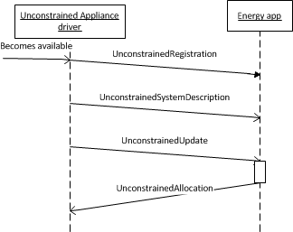
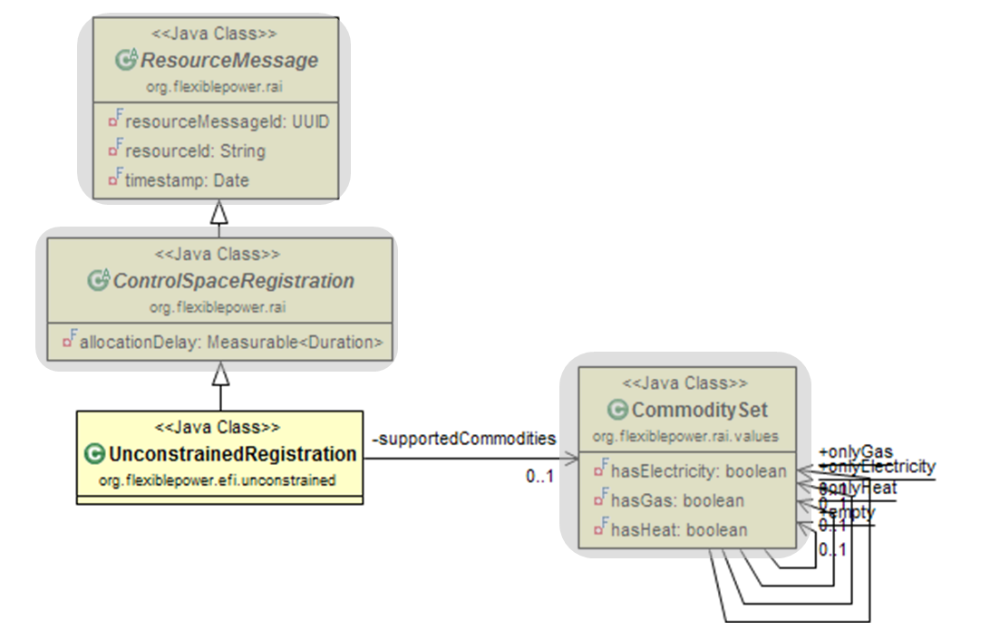
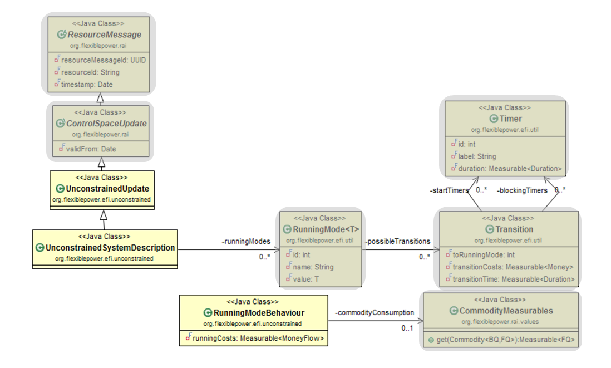
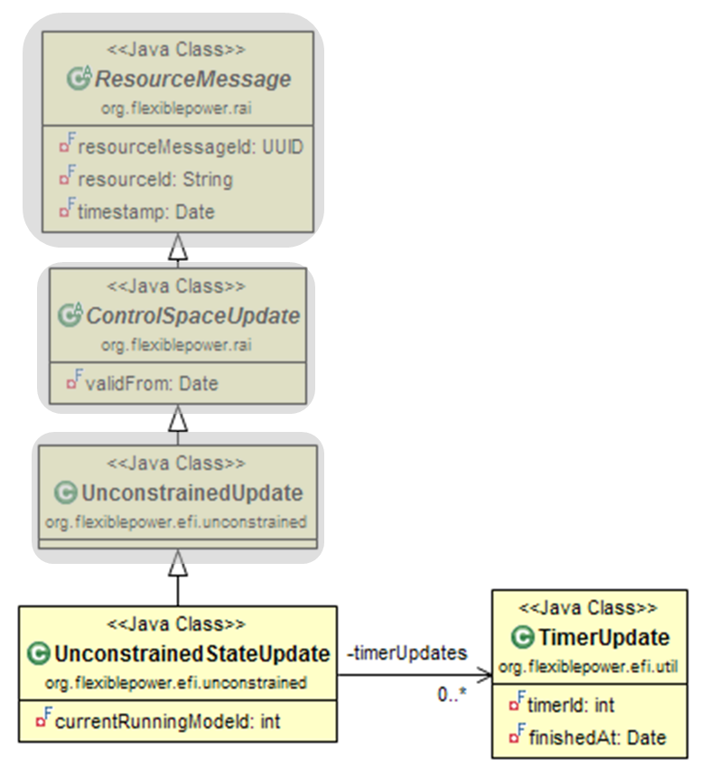
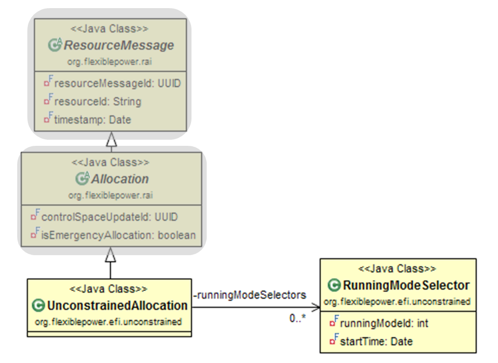

# Unconstrained EFI

As explained in the previous chapter, a buffering appliance can only be operated within the limitations of the buffer it manages. Consider a CHP that feeds a hot water vessel for instance. If the water in the vessel has reached its maximum temperature, the CHP cannot be switched on anymore. Conversely when the water temperature drops below its minimum the CHP has to be switched on.

Unconstrained appliances are not (directly) coupled with a buffer and are therefore not restricted (or constrained) in their operation. A diesel generator is a good example of an unconstrained appliance. Given sufficient diesel, the generator can in principle be switched on/off or ramped up/down freely.

Of course there may still be some appliance internal limitations that prevent an appliance to switch from mode to another immediately. These limitations are similar to those of the actuator in a buffering appliance.

## Data Elements

### Unconstrained Registration Message

#### UnconstrainedRegistration
This class is derived from `ControlSpaceRegistration` and contains the registration items that are unique to a buffer.

Attribute | Description
--- | ---
supportedCommidities | The set of all commodities that can be produced or consumed by this appliance.

*Table 46: The attributes of the UnconstrainedRegistration class*

### Unconstrained System Description Message

#### UnconstrainedUpdate

This class is derived from ControlSpaceUpdate and is used to bundle all updates from an appliance of the unconstrained category.

It does not have any additional attributes.
#### UnconstrainedSystemDescription

This class is derived from `UnconstrainedUpdate` and contains all running modes for this appliance.

Attribute | Description
--- | ---
`runningModes` | A map of all running modes for this unconstrained appliance. The key for this map is an integer which refers to RunningMode.id.

*Table 47: The attributes of the `UnconstrainedSystemDescription` class*

#### RunningModeBehaviour

This class is used as a parameter for `RunningMode<T>`, so that `RunningMode.value` is of the typeRunningModeBehaviour.

It is important to note that this `org.flexiblepower.efi.unconstrained.RunningModeBehaviour` class is not the same one as the `org.flexiblepower.efi.buffer.RunningModeBehaviour` for a buffer appliance, as can be seen from the respective package names.

Attribute | Description
--- | ---
`commodityConsumption` | This attribute contains the flow rate of all commodities that are involved in this `RunningModeBehaviour`. In the case of consumption this flowrate will be positive, it will be negative in the case of production.
`runningCosts` | Running a buffer device may cause wear. The deprecation costs for running this mode may be expressed by this attribute.

*Table 48: The attributes of the `RunningMode` class*

### Unconstrained State Update Message

#### UnconstrainedStateUpdate
This class contains up to date information about the state of the unconstrained appliance.

Attributes | Description
--- | ---
currentRunningMode | This is a set of zero or more current running modes. For every actuator there will be one current running mode.
timerUpdates | A set of zero or more `TimerUpdate` objects.

*Table 49: The attributes of the `UnconstrainedStateUpdate` class*

#### TimerUpdate
This class contains up to date information about the state of the timers.

Attribute | Description
--- | ---
`timerId` | This id refers uniquely to a timer that is associated to an actuator within a buffer appliance.
`finishedAt` |The timestamp that indicates when this timer will be finished.

*Table 50: The attributes of the `TimerUpdate` class*

### Unconstrained Allocation Message

#### UnconstrainedAllocation

This class is derived from Allocation and contains specific allocation information for a unconstrained appliance.

Attribute | Description
--- | ---
`runningModeSelectors` | A set of zero or more RunningModeSelector objects.

*Table 51: The attributes of the `UnconstrainedAllocation` class*

#### RunningModeSelector

Attribute | Description
--- | ---
`runningModeId` | An id that uniquely refers to a running mode.
`startTime` | The start time for the running mode that is referred to by the `runningModeId`.
Table 52: The attributes of the `UnconstrainedAllocation` class

## Unconstrained EFI Examples

### Diesel Generator
The following sections describe what the previously described messages would look like in the case of a diesel generator.

#### Generator Control Space Registration

The `UnconstrainedRegistration` message (see 6.2.1) communicates to the energy app which commodities are produced or consumed by this appliance. In the case of the diesel generator there will only be one commodity (ELECTRICITY) that is produced by a generator.

#### Generator Unconstrained System Description

A diesel generator can quickly adapt its power output within a continuous range (e.g. 500W - 2kW). This continuous range can be approximated by discretized steps. Each step will be represented by a RunningMode object. In this example there will be a `RunningMode` for each 50W increment. If required more fine grained steps may be used. Besides the 50W increments there will also be a RunningMode object for the switched off state.

Each RunningModeBehaviour object has a runningCosts attribute. In our example this will be used to express the costs of burning diesel in a particular `RunningMode`. These costs can be used by the energy app to determine the efficiency.

In this example there are three `Timer` objects for on, off and modulation (within the 500W - 2 kW range). On, Off and Modulation are also the values of the different label attributes. The duration attribute for both the on and off Timer has a value of 10 minutes (to allow the generator to properly warm up or cool down). Once switched on, the generator can very quickly vary within its range, therefore the modulation Timer object has a duration of 0 seconds.

Each `RunningMode` object will be accompanied by a `Transition` object that allows the transition to that RunningMode; referred to by the `toRunningMode` attribute. A `RunningMode` has a list of possibleTransitions. For the off RunningMode all transitions to the 500W - 2kW range are possible. Within this range transitions can be made to all other steps of the range and the off RunningMode. In our example there will be no transitionCosts for a transition; the value of this attribute will be set to 0.

#### Generator Unconstrained State Update
This message describes the current state of the diesel generator. It contains a `UnconstrainedStateUpdate` object which has a `currentRunningModeId` attribute that refers to the RunningMode that is currently active.

The `UnconstrainedStateUpdate` also refers to three `TimerUpdate` objects representing on, off and modulation respectively. The timerId attribute refers to the correct `Timer` object and the `finishedAt` attribute gives the latest information on the finish time for this Timer.

#### Generator Unconstrained Allocation
The allocation message for our generator example simply consists of a list of `RunningModeSelectors` objects. They contain a `runningModeId` attribute (referring to a particular `RunningMode` that is selected) and a `startTime` attribute that indicates when it needs to be started.