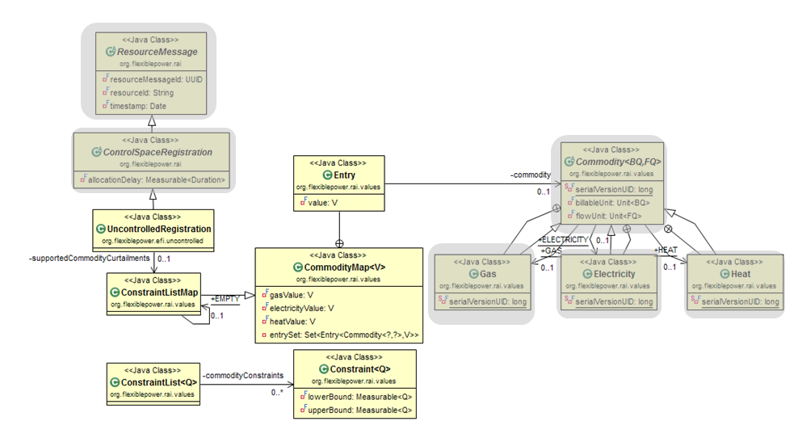
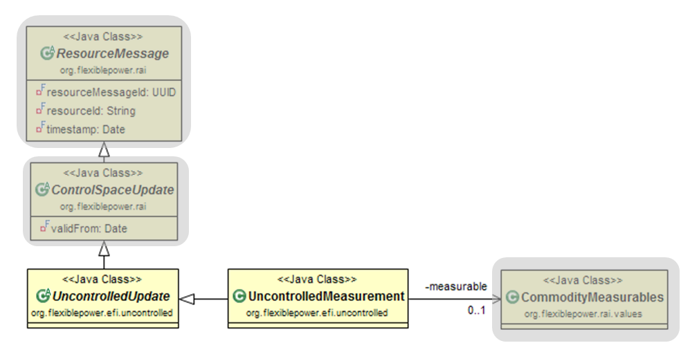
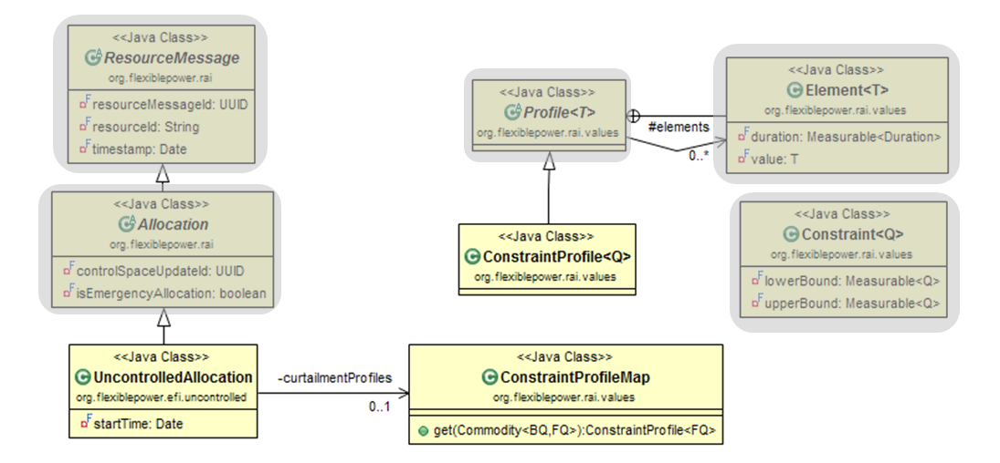
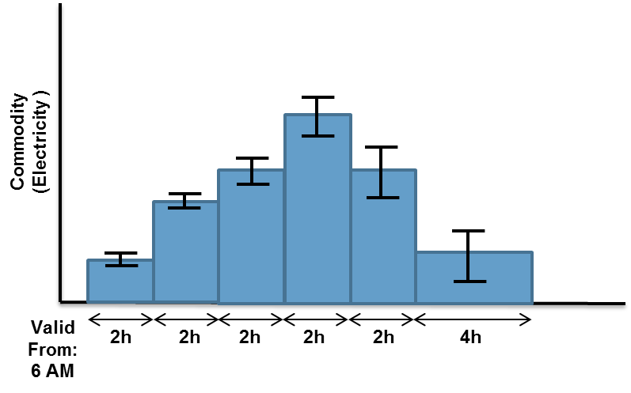

# Uncontrolled EFI

Uncontrolled appliances are appliances with no energy flexibility. The appliance must execute its functionality directly after receiving a trigger to start. Typical examples are brown goods and renewable energy generation units.

Examples Appliances: PV, TV, Computer, Wind Turbine

## Data Elements

This section contains a description for each data element that parameterises the uncontrolled EFI. The first three subsections contain a UML representation and a parameter description of the three messages: registration, update and allocation message.

Finally two examples on how to use the uncontrolled EFI are provided.

### Uncontrolled Registration Control Space Message

The following figure represents the data elements of an uncontrolled control sp ace registration message. Table 17 reveals the description of the used parameters.

#### UncontrolledRegistration
The `UncontrolledRegistration` object registers the appliance driver to the energy app, the message is describes the commodities that are consumed or produced by the uncontrolled appliance with the Commodity attribute. Furthermore if the modelled appliance has features that allow curtailing the consumption or production of the device, the curtail options can be expressed in a `ConstraintList` for every commodity.

Attribute | Description
--- | ---
`supportedCommodityCurtailments` | A map of every applicable `Commodity` for the appliance as key and a `ConstriantList` representing the list of  possible curtail steps as an value.  The value of the map is optional and will only be provided if the appliance supports curtailing, otherwise it must be null.

*Table 14: Attribute Descriptions of the `UncontrolledRegistration` class*

#### CommodityMap<V>

This is a utility class that efficiently stores values for each type of `Commodity`. This map has less overhead than the `HashMap` or `TreeMap` implementations, because it just stores one reference for each commodity type.

It is parameterized so that it can contain any class as a value.

Attribute | Description
--- | ---
`gasValue` | This attribute allows direct access to the value that corresponds with the gas commodity key.
`electricityValue` | This attribute allows direct access to the value that corresponds with the electricity commodity key.
`heatValue` | This attribute allows direct access to the value that corresponds with the heat commodity key.
`entrySet` | This attributes holds the complete set of `Entry` objects. An `Entry` has a commodity as a key and can hold any value type.

*Table 15: Attribute Descriptions of the `CommodityMap` class*

#### Entry

This class represents a single entry in the `CommodityMap<V>`. It has a commodity as a key and can hold any value type.

Attribute | Description
--- | ---
`commodity` | This attribute holds the commodity that this `Entry` holds a value for.
`value` | The value can be of any type.

*Table 16: Attribute Descriptions of the Entry class*

#### ConstraintListMap

This class is derived from `CommodityMap<V>`. In the case of a `ConstraintListMap` the `CommodityMap` is parameterized with a `ConstrainList<Q>`. This is not directly visible in the figure, but is ensured via builder classes.

#### ConstraintList

In the `UncontrolledRegistration` object the `ConstraintList` describes the curtail levels supported by the modelled appliance. For example, if the power consumption of an air-conditioning unit can be curtailed to 1500 Watt, 750 Watt and 0 Watt. The `ConstaintList` contains those three values.

#### Constraint

A Constraint describes a value or a range of values from a certain `Quantity` (i.e. Watt). If it represents a single value then `LowerBound` and `UpperBound` will be equal.

Attribute | Description
--- | ---
`LowerBound` | The lower bound of the range or the value.
`UpperBound` | The upper bound of the range or the value.

Table 17: Attribute Descriptions of the `Constraint` class**

### Uncontrolled Control Space Measurement Update Message

The uncontrolled control space measurement update message is used for updating the consumption/production information of an appliance form the appliance driver to the energy app. Since the energy behaviour of an uncontrolled appliance can be very  unpredictable (for instance the power output of a PV inverter), this measurement update message only contains a measured value and does not provide any information on how long this value is valid. Typically the appliance driver must send a new measurement update message to the energy app whenever the value of the measurement is updated.

#### UncontrolledMeasurement

Attribute | Description
--- | ---
`measurable` | This attribute is of the type `CommodityMeasurables`. It contains the actual measurements for an uncontrolled appliance.

*Table 18: Attribute descriptions of `UncontrolledMeasurement` class.*

### Uncontrolled Control Space Forecast Update Message
The following figure represents the data elements of an uncontrolled control space update forecast message. This message is optional and can only be used if there is a mechanism in the appliance driver that can calculate a consumption/production forecast.

#### UncontrolledUpdate
Marker class for updates for uncontrolled appliances.

#### UncontrolledForecast
The `UncontrolledForecast` class contains a consumption or production forecast. This information is represented by an instance of `CommodityForecast`.

The `CommodityForecast` class does not specify a startime for the forecast profile. For this purpose the `ControlSpaceUpdate.validFrom` is used, it marks the start time of the `CommodityForecast` profile.

Attribute | Description
--- | ---
forecast | This attribute is of the type `CommodityForecast` and contains the actual forecast profile.

*Table 19: Attribute descriptions of UncontrolledUpdate class.*

### Uncontrolled Allocation
The following figure represents the data elements of an uncontrolled allocation message. An allocation will only be send to appliances which support curtailing production/consumption.

#### UncontrolledAllocation

After receiving an `UncontrolledAllocation` from an energy app the appliance driver should follow one or more `curtailmentProfiles` (each commodity may have its own curtailment profile). This message contains these profiles and their `startTime`.

Attribute | Description
--- | ---
`startTime` | The time at which the `curtailmentProfiles` should start.
`curtailmentProfiles` | This attribute is of the `ConstraintProfileMap` type. For every applicable commodity it contains a `ConstraintProfile`.

*Table 20: Attribute descriptions of `UncontrolledAllocation` class.*

#### ConstraintProfileMap

As the name of this class implies it is a map of `ConstraintProfile<Q>` objects which uses `Commodity<BQ,FQ>` as a key.

Method | Description
--- | ---
`get(Commodity<BQ,FQ>)`: `ConstraintProfile<Q>` | This method returns a `ConstraintProfile<Q>` for a particular commodity. The `Commodity<BQ,FQ>` of interest is given as an argument.

*Table 21: Method descriptions of `ConstraintProfile` class.*

#### ConstraintProfile

The `ConstraintProfile<Q>` is extended from the `Profile` class. It is parameterized with a quantity Q, which is the flow quantity (FQ) from the commodity that needs to be curtailed.

The `ConstraintProfile<Q>.value` is of the type `Constraint<Q>`. This is the same flow quantity as described above. Although this is not visible in the UML diagram, it is enforced in the builder classes that are used to construct a `ConstraintProfile<Q>`.

The lower - and upper bound attributes of `Constraint<Q>` represent the curtailment levels. If for instance a PV panel needs to be curtailed at 2000 Watt, the lower bound would be -2000 and the upper bound 0 (production is interpreted as negative consumption).

`ConstraintProfile<Q>` has no additional attributes.

### Uncontrolled EFI Examples
This section provides two examples on how to use the uncontrolled EFI. In the first example the use of an uncontrolled EFI is explained when representing a desktop computer. In the second example the use of the uncontrolled EFI is explained when representing a PV inverter with grid emergency shutoff features.

### Desktop Computer example

The standard way in which a desktop computer operates offers no energy flexibility. The appliance must be supplied with power whenever the end-user wishes to use the unit. It has no method of storing energy once the electricity supply has been switched off. As such it can be modelled as an uncontrolled appliance.

#### Desktop Computer Control Space Registration

The control space registration message which commodities are consumed by the appliance and if it is able to curtail it power consumption. For a desktop computer the Commodity will typically be Electricity and it won’t support features to curtail its power consumption, therefore the ConstraintList will be empty.

#### Desktop Computer Control Space Update

The control space update consists of a CommodityForecast which for a desktop computer describes the amount of electricity consumption and could, for example, take a constant value over time. This will have a unique resourceMessageId associated with it.

#### Desktop Computer Allocation

Typically a desktop computer runs uncontrolled, which means it is not controlled by a smart grid service and the user is able to switch it on and off at any time. Therefore the desktop computer does not receive allocations.

### PV Example

Photovoltaics (PV) are used to generate electricity directly from solar radiation. The energy generated by these devices is uncontrolled as the level of generation is variable. It is however possible to estimate the level of generation in the future to produce a forecast (see below).

#### PV Control Space Registration

The control space registration message which commodities are consumed by the appliance and if it is able to curtail it power consumption. For a PV Inverter the Commodity will typically be Electricity. In this example it supports features to curtail its power consumption, therefore the ConstraintList will contain the values 1500, 1000, 500 and 0 Watt.

#### PV Control Space Measurement Update

The control space consists of a UncontrolledMeasurement which for a PV inverter describes the amount of electricity produced at the time of creation of the control space. This will have a unique resourceMessageId associated with it.

#### PV Allocation

Typically a PV inverter will run uncontrolled and produce as much energy as possible, however if the inverter supports remote dimming this feature can be used by sending an allocation to the device.

In a grid emergency situation, it is possible that the energy service desires the PV inverter to reduce power output. An allocation would be sent, which would request the appliance to change its energy production. The allocation consists of a resourceMessageId which matches the control space id (generated in 1) and curtailmentProfiles that should be followed by the PV inverter.

#### PV Forecast

The application driver of the PV inverter has the ability to generate a production forecast based on weather forecast. The forecast is generated once every day once at 6 AM. In order to send the forecast to an energy app the Uncontrolled Forecast Update is used (Section 3.1.3). The forecast itself can be defined in the UncontrolledForecast class (Section 3.1.3.2). The forecasted profile created at 6 AM is depicted in Figure 16.  It contains a start time (validFrom in ControlSpaceUpdate class) and a number of bins CommodityForecast.Element with a duration (duration in CommodityForecast.Element) and parameterized with the CommodityUncertainMeasurables class which is able to express uncertainty.

